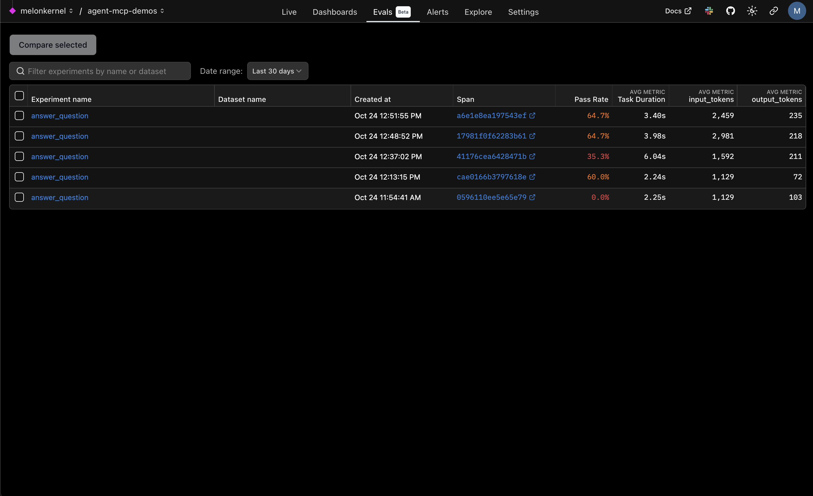
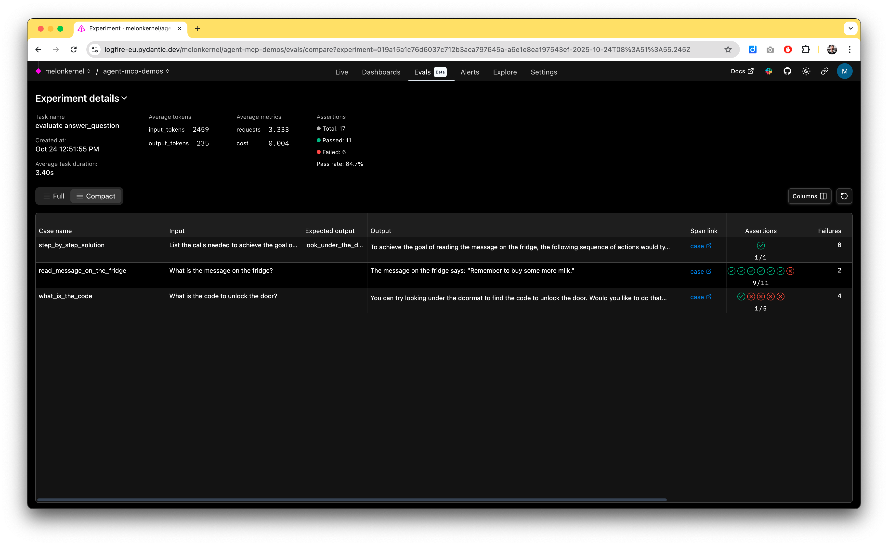
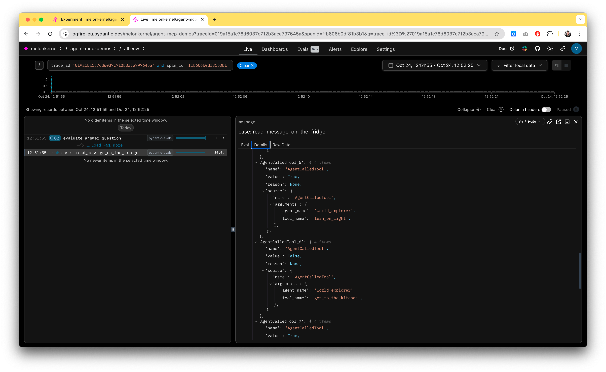

# Evals

## Dependencies
- Logfire (get started here https://logfire-eu.pydantic.dev/)
- Pydantic AI
- Pydantic Eval
- pydantic_ai_examples (for the custom evaluator checking tool calls, using the logfire spans)

## Use case

- Shows how to create and use LLM Evals using Pydantic Eval
- Shows how to verify that an agent has used certain tools in order to come up with their answer.

## Usage

```bash
uv run python agent_mcp_demos/src/evals/tool_calls.py
```

### Example Output

When you run `agent_mcp_demos/src/evals/tool_calls.py`, you should see an eval report printed. You can also view a timeline of tool calls and agent thoughts in [Logfire](https://logfire-eu.pydantic.dev/).

**Example output:**  

The script does the following:
- Defines an `Agent` that can solve simple puzzles using available tools to interact with a simulated world (unlock the door, read messages, etc).
- Configures several tool functions the agent can call.
- Sets up a series of eval `Case`s to check agent behavior, including:
  - Did the agent use the correct tool(s)?
  - Did the agent produce the correct answer?  
- Uses custom evaluators (e.g., `AgentCalledTool`) to verify tool usage via Logfire traces.

You can add your own eval cases or modify tool descriptions to experiment further. 

See `tool_calls.py` for full details or try editing it to add your own puzzles and tools!







